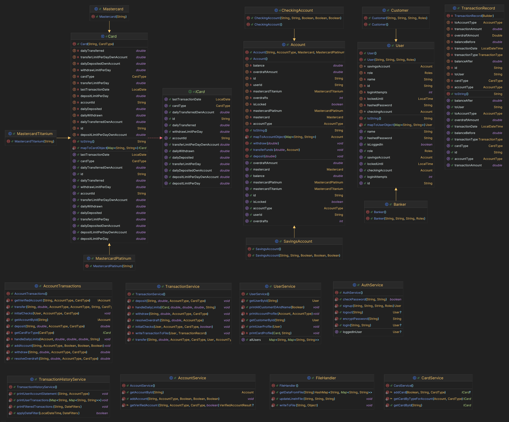

# ACME Banking System

This is a simple banking system implemented in Java. It allows users to create accounts, deposit, withdraw and transfer
money, and view their account balance. The system uses a command-line interface for user interaction.

## UML Diagram

## Technologies used

- Java

## Trello board

- https://trello.com/b/tSBt3k1B/java-banking-app

## Additional resources

- https://www.baeldung.com/java-builder-pattern
- https://www.baeldung.com/java-md5
- https://stackoverflow.com/questions/2832472/how-to-return-2-values-from-a-java-method
- https://www.baeldung.com/a-guide-to-java-enums
- https://docs.oracle.com/en/java/